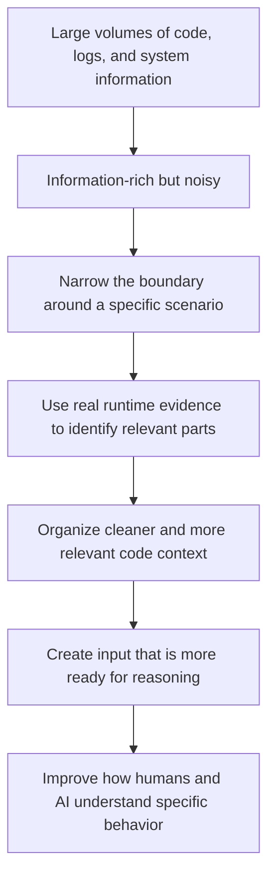

# Understanding Complex Systems from Scenarios: A Technical Position on Code Context in the AI Era

> This article discusses a general technical perspective on understanding complex systems and organizing AI context. It does not involve any specific company’s business systems, implementation details, or non-public information.
>
> The discussion here is intentionally conceptual and does not describe any proprietary implementation, internal tooling, or organization-specific workflow.

Over the years, I have kept returning to one question:

> When a specific behavior occurs in a complex system, how should we actually understand it?

By “understand,” I do not mean looking at a few monitoring charts, skimming an architecture diagram, or mechanically browsing files in a source repository. What I really care about is a more concrete and much harder class of questions:

- Why did a particular request produce this result?
- Along what path did a particular failure gradually form?
- Which pieces of code actually participated in the execution behind a given abnormal behavior?
- Among sprawling call chains, configurations, thread activities, and log data, which parts are truly relevant, and which are merely background noise?

I have increasingly felt that the understanding of complex systems has long been dominated by a perspective that seems reasonable, but is not always effective enough: **looking at the system globally**.

But in many cases, what truly needs to be understood is not how the system works as a whole, but rather this:

> **How exactly did this specific behavior happen?**

It is in this sense that I have gradually formed a more stable judgment:

> **To understand complex systems, the most natural and operationally useful unit of entry is often not the whole system, but the scenario.**

---

## 1. Why a Global Perspective Is Not the Same as an Understanding Perspective

Modern system observability is naturally biased toward the global:

- sampling;
- aggregation;
- statistics;
- trend observation;
- hotspot identification;
- anomaly detection.

This logic is certainly valuable—highly valuable, in fact. If what you care about is capacity, health, fluctuations, slow interfaces, error rates, or resource usage, it is almost irreplaceable.

But I have always felt that the questions it is good at answering are not the same kind of questions as *understanding a specific behavior*.

It is good at answering questions like these:

- Which interface is slowest overall?
- Which machine was busiest during a certain period?
- Which class of errors has recently increased significantly?
- Which module is most worthy of attention in a statistical sense?

But it is not good at answering questions like these:

- What execution path did one real request actually take?
- In which code branches was a specific failure amplified step by step?
- Which modules appear relevant, but in this instance did not participate at all?
- Which execution relationships are key causal links, and which are just part of the system background?

These two kinds of questions may look similar, but they are fundamentally different.

The former is a **problem of overall cognition**.  
The latter is a **problem of process reconstruction**.

In many frontline engineering situations, the latter is exactly what is hardest, most time-consuming, and most decisive for judgment quality. Because the real engineering difficulty is often not *seeing a lot*, but **being unable to identify this one case accurately within all that information**.

---

## 2. Why I Prefer to Treat the Scenario as the Basic Unit of Understanding

By “scenario,” I do not mean a broad business category, nor the kind of vague label one often sees in product documents, such as “payment scenario” or “order placement scenario.”

I prefer to understand it as a **real process whose boundaries can be defined**. For example:

- a specific request;
- a task transition;
- a failure trigger chain;
- an exploit path;
- an actual execution fragment in a distributed system.

In other words, a scenario is not an abstract tag. It is an analytical object around which evidence can be organized, boundaries can be narrowed, and causal relationships can be discussed.

Once you take the scenario as the starting point for understanding a system, your perspective changes fundamentally.

You no longer try to understand the whole system all at once.  
You begin to accept that *local but accurate* is often more valuable than *global but vague*.  
You no longer assume that all neighboring code is equally important.  
And you no longer treat logs and tracing data merely as statistical material, but as traces left behind by a real process.

This may seem like only a shift in analytical angle, but in engineering practice it directly determines whether you can truly get closer to the problem itself.

Because in many cases, systems are not incomprehensible. Rather, we have chosen an observational unit that does not fit the problem we are trying to solve.

---

## 3. If the Goal Is to Understand Specific Behavior, We Must Give More Weight to Runtime Facts

Complex systems have a characteristic that is easy to underestimate:

> **Their real meaning often lies not on the surface of the source code, but in what happens during execution.**

Static code is important. Configuration is important. Architecture diagrams are important. But if the question is *why did this particular behavior happen this way*, then static material alone is usually not enough.

The reasons are practical:

- Much code that is theoretically relevant may not execute at all in a specific scenario.
- Many truly critical branches reveal their importance only when actual conditions trigger them.
- Relationships among threads, asynchronous tasks, context switches, and external dependencies are hard to grasp accurately without runtime facts.
- Many decisive factors in system behavior do not live in class diagrams, but in that one real execution.

So I have come to value an extremely simple principle more and more:

> **Understanding a specific scenario should, as much as possible, be built on real runtime evidence rather than primarily on retrospective speculation.**

What I want to emphasize here is not any particular tool or fixed collection method, but a more fundamental engineering attitude:

- trust what actually happened first;
- focus first on the parts that truly participated in producing the result in this scenario;
- let analysis rest first on traceable facts, rather than on imagination about what might theoretically have happened.

In my view, this is not just about gathering a bit more runtime information. It is about laying a stronger foundation for system understanding.

---

## 4. What Is Actually Scarce Is Not Information, but Low-Noise Relevant Information

One of the most common problems in large systems is not too little information, but too much.

There is too much code, too many modules, too many configurations, too many logs, too many traces, and too many possibilities. But the real difficulty is this:

> **Most of this information is not organized in the way the current problem actually needs.**

As a result, both humans and AI run into the same predicament:

- files are too long;
- directories are too deep;
- framework layers are too thick;
- boilerplate is too abundant;
- call relationships seem connectable everywhere;
- yet the path that truly caused the current behavior is buried under a pile of superficially relevant information.

This has made me increasingly aware of one thing:

> **What code understanding often lacks is not more context, but cleaner context.**

If we cannot first narrow the boundaries, cannot first organize the parts that truly participated in this scenario, and cannot first suppress content that is clearly irrelevant but cognitively burdensome, then both humans and AI can only struggle to guess within the noise.

So in my view, an underrated capability in system understanding is not *collecting*, but *organizing*:

- organizing around a specific scenario;
- organizing around real evidence;
- organizing around relevance rather than around total code volume.

Only then can understanding have a chance to move from *information accumulation* to **reasoning-ready input**.

---

## 5. Why This Becomes Even More Critical in the AI Era

*Figure 1. This article’s emphasis is not a specific implementation, but a way of understanding that moves from noisy system information toward scenario-centered, runtime-grounded, reasoning-ready context.*

Even before large models, this way of thinking already mattered. It affects incident diagnosis, system investigation, behavior explanation, knowledge accumulation, and even whether a team can truly take over a complex system.

But the arrival of AI has amplified its importance even further.

One of the core bottlenecks of large models in code understanding is often not that they are completely unable to analyze, but rather this:

> **The input we give them was never prepared for accurately understanding the current problem in the first place.**

In many cases, the material fed into the model contains:

- large amounts of content irrelevant to the current task;
- no highlighting of the key execution path;
- static structure mixed together with dynamic facts;
- no organization of the important causal relationships;
- and information that is actually decisive gets drowned out by framework code, common layers, and background dependencies.

Under those conditions, no matter how powerful the model is, it can only perform costly inference over noisy input. It is not that the model lacks ability; it lacks a better entry point for understanding.

So I have long believed that one increasingly important engineering concern in the AI programming era is not just the model itself, but this:

> **How to organize real scenarios in complex systems into context that is more suitable for model consumption.**

The significance of this is no smaller than model upgrades themselves. Because many cases of so-called *the model cannot understand it* may in fact be cases where *we did not present the problem in a form that could be understood*.

---

## 6. Several Judgments I Have Gradually Formed

After years of observation and repeated reflection, I have arrived at several judgments that have become increasingly clear.

### 1. The first unit of understanding complex systems should often be the scenario

The global perspective has irreplaceable value. But once the question becomes *why did this happen this time*, the scenario is closer to the answer than the global view.

### 2. Analysis of specific behavior should not remain at the level of purely static text for too long

Static code provides structure. But the running system provides facts. Without factual support, understanding often remains at the level of *seems reasonable*.

### 3. Context quality matters more than context quantity

Especially for AI, input that is highly relevant, clearly bounded, and relatively low-noise is usually more valuable than massive but chaotic input.

### 4. Future tools for program understanding will likely need to balance observability and organization

If there is only observability without organization, information quickly gets out of control. If there is only summarization without runtime grounding, understanding easily becomes distorted. A useful direction is to let **fact acquisition** and **relevance organization** reinforce each other.

---

## 7. This Is Not Just Another Monitoring Tool, but an Attempt to Strengthen the Practical Foundation for Understanding

I increasingly see this direction as a more foundational issue. It is not merely building another observability system, nor merely showing logs in a different way.

It is closer to answering this question:

> **As systems grow more complex, codebases grow larger, and AI becomes increasingly involved in development workflows, what do we actually rely on to build reliable program-understanding capability?**

Without better support for understanding, we will keep falling into the same trap:

- lots of observability, but weak explanation;
- lots of data, but unclear boundaries;
- all the code is there, but the truly relevant parts do not surface;
- AI can participate in many tasks, but the input it receives is not suitable for high-quality reasoning.

So in my view, the point has never been *seeing more of the system*, but rather this:

> **Whether we can see one specific behavior more accurately.**

That is why I have always felt that this is not exactly the same as the traditional global-monitoring mindset. It is closer to an effort to build a better entry point for understanding around real scenarios.

---

## 8. Why I Am Willing to Write This Down

I am writing this not because I want to package it as some grand conclusion that is already complete. On the contrary, I prefer to see it as a technical judgment that has been reinforced over time through engineering experience.

Many truly important directions do not necessarily look mainstream at the beginning. They often do not grow out of polished slogans, but out of intuitions formed through long-term engagement with concrete problems—intuitions that become harder and harder to ignore.

For me, that intuition is very simple:

- if I want to truly understand complex systems;
- if I want to reduce noise in analysis;
- if I want to make it easier for AI to get closer to the truly relevant code;
- then I cannot be satisfied with a sampling perspective, a summarization perspective, or a static stacking perspective alone.

I have to take more seriously:

- specific scenarios;
- real execution;
- relevance boundaries;
- and context organization itself.

I am willing to write this down because I believe:

> **Future software-understanding capability will increasingly depend on whether we can organize real behaviors in complex systems into context that is understandable, reasoning-ready, and focusable.**

---

## 9. The Core Position, Compressed

If I compress this article into its core position, it is roughly this:

1. **When understanding complex systems, scenarios are often closer to the real problem than global statistics.**
2. **When analyzing specific behavior, real runtime evidence is usually more reliable than abstract speculation.**
3. **The true value of runtime information lies not only in observability, but in helping narrow and organize the relevant code context.**
4. **One of the most important practical capabilities in the AI era is not feeding more code into models, but providing models with context that is more relevant, cleaner, and easier to reason over.**

---

## Conclusion

I would like to treat this article as a public record of a technical position:

> **In the AI era, understanding complex systems should not rely only on global views, statistical summaries, and static accumulation. It should increasingly center on specific scenarios, real execution evidence, and the organization of relevant context.**

I believe more and more practices, tools, and methods will continue to develop in this direction.

And what I hope to do, at minimum, is make this point clear:

**If we truly want to improve how humans and AI understand complex systems, this path deserves to be taken seriously.**
