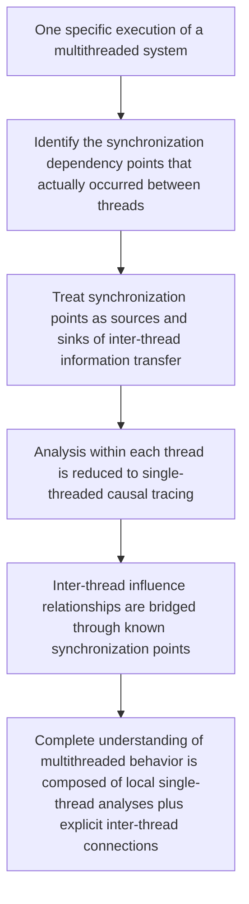

# Understanding Multithreaded Behavior: From Inter-Thread Synchronization Dependencies to Single-Thread Problem Reduction

> This article discusses a general technical perspective on understanding multithreaded system behavior. It does not involve any specific company's business systems, implementation details, or non-public information.
> 
> The discussion here is intentionally conceptual and does not describe any proprietary implementation, internal tooling, or organization-specific workflow.

Over the years, on the path toward understanding specific behaviors in complex systems, I have repeatedly run into an obstacle that cannot be bypassed:

> Once a system involves multiple threads, the difficulty of understanding does not grow linearly—it changes structurally.

A single-threaded program, no matter how complex, has at least one basic guarantee: the order of execution is deterministic. You can trace along a single path, and although the causal chain may be long, its direction is clear.

Multithreaded systems are not like that. In a multithreaded system, multiple execution flows exist simultaneously, and their interactions—some explicit, some implicit—form a dynamically woven network. Understanding any specific behavior means not only understanding what each individual thread did, but also understanding when, through what mechanism, and in what order threads influenced one another.

This problem troubled me for a long time. And the judgment I gradually formed is this:

> **The key to understanding multithreaded behavior often lies not in observing all threads simultaneously, but in accurately identifying the synchronization dependencies between them.**

---

## 1. Why Multithreading Makes Understanding Structurally Harder

The complexity of multithreaded systems appears, on the surface, to come from the large number of threads, the many execution paths, and the vast number of possible interleavings. But in my view, the real difficulty runs deeper:

> **Multithreading breaks the locality of causality.**

In a single-threaded program, if you see that a variable holds an unexpected value, you can trace backward through the code to find where it was last assigned. Causality is local and traceable.

In a multithreaded program, this premise no longer holds. A variable's value may have been modified by another thread at a moment you did not directly observe. A change in state may not have been caused by the current thread's execution logic at all, but rather transmitted indirectly from another execution flow through some shared resource, through the release and acquisition of a lock, or through the posting and consumption of a message in a queue.

This means that to understand a specific behavior in a multithreaded system, you are not facing a single causal chain, but a complex graph structure in which multiple causal chains have crossing points.

In actual engineering practice, this difficulty typically manifests in several characteristic ways:

You can clearly see that the problem occurred in one thread, but the real cause lies in another. Two threads each appear to have correct logic individually, yet produce unexpected results when combined. Logs record the activities of all threads, but faced with the massive volume of interleaved information, you still cannot reconstruct how this particular behavior actually unfolded.

The common root of all these situations is not insufficient information, but rather that **the relationships between threads have not been made explicit**.

---

## 2. Why Traditional Approaches Feel Strained Here

Faced with the complexity of multithreading, engineering practice has long relied on several main coping strategies.

One is **static reasoning**. By reading the code, you analyze all possible thread interaction paths and reason about possible execution orderings and potential problems. This approach is effective when the system is small and thread interaction patterns are simple. But as system scale grows, the number of possible interleavings increases exponentially, and pure static reasoning quickly exceeds what human effort—or even tools—can exhaustively cover. More critically, static reasoning answers "what could theoretically happen," not "what actually happened this time."

Another is **exhaustive recording followed by post-hoc analysis**. You record all activities of all threads, then sort by timestamps or logical clocks after the fact, attempting to reconstruct the complete execution history. The problem with this approach has already been discussed in my earlier writing—information explodes, and noise drowns out signal. In multithreaded scenarios this problem is even more severe, because the more threads there are, the more enormous the combinatorial space of interleaved information becomes, while the portion truly relevant to the behavior under investigation is often only a small subset.

A third approach is **model checking or formal verification**. This is the most rigorous in theory, but in real large-scale engineering systems, the cost of modeling and the state-space explosion problem significantly limit its applicability.

I am not saying these methods lack value. Each has its suitable scenarios and irreplaceable strengths. But when the question is "how did this particular multithreaded behavior actually happen," they share a common shortcoming:

> **They either try to cover all possibilities or try to record everything, but none directly answers: in this one execution, what were the actual influence relationships between threads?**

---

## 3. A Gradually Clarifying Idea: Focus Attention on Synchronization Dependencies

After repeatedly encountering the predicament described above, I began to realize something:

> **Although multithreaded systems are complex, threads do not interact in arbitrary ways. Their interactions always occur through certain specific mechanisms.**

Whether it is reading and writing shared variables, acquiring and releasing locks, posting to and consuming from message queues, waiting on and releasing semaphores, or any other form of inter-thread communication—these are the "channels" through which influence relationships between threads actually take place.

Put differently: causality between threads is not diffuse. It is **transmitted through specific synchronization points**.

This recognition is not novel in itself. The "happens-before" relation in concurrency theory pointed this out long ago. But in engineering practice, I feel that the operational implications of this recognition have never been fully exploited—especially in the context of "understanding one specific behavior."

The idea I gradually formed goes like this:

> **If, in one actual execution, we can accurately identify the points where synchronization dependencies between threads truly occurred, then the structure of the multithreaded understanding problem changes fundamentally.**

Because once synchronization dependencies are identified, the "connection points" between threads become known, finite, and enumerable. Each such connection point is, in essence, a location where information was transmitted from one thread to another.

---

## 4. A Critical Transformation: From a Multithreaded Problem to a Single-Threaded Problem

*Figure 1. The core idea discussed in this article: by identifying inter-thread synchronization dependencies, multithreaded behavior understanding is transformed into a problem that can be decomposed and handled locally, with synchronization points as the boundaries.*

Under this line of thinking, the most important corollary is:

> **If synchronization dependency points are accurately identified, then the problem of understanding multithreaded behavior can, to a large extent, be transformed into a single-threaded problem.**

The reasoning is as follows: within any single thread, execution order is still deterministic. Influence from other threads can only enter through the identified synchronization points. If we treat these synchronization points as "entry and exit points for information"—that is, as sources and sinks—then tracing how a piece of information propagates from an entry point to an exit point within each thread is, in fact, a classic single-threaded propagation analysis problem.

The significance of this transformation is substantial:

Single-threaded causal tracing is a problem domain that has been extensively studied, validated through practice, and supported by relatively mature tooling, with comparatively high accuracy. Multithreaded interleaving analysis, on the other hand, has always been one of the areas where accuracy is hardest to guarantee.

If, through accurate identification of synchronization dependencies, the latter can be transformed into the former, then the accuracy of the analysis gains a much more solid foundation. Not because the multithreaded problem itself became simpler, but because **we found a way to decompose it such that each subproblem falls within a tractable analytical framework**.

---

## 5. Several Premises and Boundaries of This Approach

I do not want to present this idea as a universal solution. It has several important premises and boundaries that must be honestly acknowledged.

First, **the identification of synchronization dependencies must be based on actual execution, not solely on static code analysis**. Code may contain a large number of potential synchronization mechanisms—shared variables, locks, queues, semaphores—but in one specific execution, only a subset of these actually participated in inter-thread information transfer. If analyzed purely from a static perspective, a large number of theoretically possible but actually unrealized relationships would be introduced, and these false relationships would seriously interfere with subsequent analysis. Runtime facts, therefore, are not an optional supplement here but a necessary foundation.

Second, **the value of this approach lies in understanding one specific behavior, not in exhaustively enumerating all possible behaviors**. It does not replace model checking or formal verification. It addresses "what happened this time," not "could something go wrong under all possible conditions." Both questions have value, but they require different methods.

Third, **the coverage of synchronization mechanisms directly determines the completeness of the analysis**. If some form of inter-thread communication is not taken into account, then the influence transmitted through that mechanism will become a blind spot in the analysis. This requires a systematic understanding of the concurrency primitives in the target language and runtime environment, and demands a clear-eyed awareness of the boundaries of that coverage.

Fourth, **after the transformation into single-threaded problems, the accuracy of the analysis still depends on the quality of the single-threaded analysis itself**. This approach reduces the structural complexity of the problem, but does not eliminate all difficulties. It merely decomposes an extremely hard problem into a number of relatively more tractable subproblems.

---

## 6. Why This Is Consistent with the Scenario-Centered Approach

Those who have read my earlier discussion on understanding complex systems through scenarios may notice that the inter-thread synchronization dependency analysis discussed here is, in fact, a natural extension of the same fundamental position into the domain of multithreading.

That fundamental position is:

> **Understanding specific behavior in complex systems should be grounded in facts that actually occurred, organized around scenarios as the unit, and bounded by relevance.**

In the multithreaded context, this means: do not attempt to understand all possible interactions across all threads at once, but instead focus on the inter-thread dependencies that actually occurred in one specific execution. Synchronization points are the concrete embodiment of inter-thread relevance. Identifying synchronization points is equivalent to identifying the real relational boundaries between threads in this particular execution.

And after the problem is transformed into single-threaded analysis, we return to that basic principle: conducting more accurate causal tracing within a clearer, lower-noise scope.

In my view, this is not a coincidence but a consistent manifestation of the same thinking framework at different levels:

Whether facing cross-service calls in a distributed system or multi-thread interactions within a single process, the fundamental logic for understanding specific behavior is the same—find the real paths of relevance, suppress irrelevant noise, and let analysis rest on traceable facts.

---

## 7. What This Means for AI-Assisted Code Understanding

This line of thinking carries an additional layer of significance when AI becomes involved in code understanding.

One of the most prominent difficulties large models face when analyzing code is multithreading. The reason is straightforward: multithreaded behavior depends on execution timing, and timing information is almost invisible in static code. Giving a model the source code of a multithreaded program and asking it to reason about the cause of a concurrent behavior is essentially asking it to guess the interleaving order of threads without any runtime information. This is extremely difficult for any reasoning system.

But if, in the context provided to the model, the synchronization dependencies between threads have already been identified, then what the model faces is no longer an open-ended problem requiring it to guess interleaving orders. It faces a set of known inter-thread connection points, and between those connection points, execution fragments that can be traced using single-threaded logic.

This is entirely consistent with the earlier discussion about "providing models with context that is more suitable for reasoning":

> **It is not about making the model more powerful, but about making the input the model receives closer to the essential structure of the problem.**

Multithreaded analysis is hard in large part because the way the problem is presented (interleaved, nondeterministic, implicitly correlated) fundamentally mismatches the mode of reasoning that both humans and AI are best at (sequential, causal, locally traceable). The identification of synchronization dependencies and the transformation into single-threaded subproblems is, in essence, an effort to narrow this mismatch.

---

## 8. Several Judgments That Have Become Increasingly Clear

Around the understanding of multithreaded behavior, through long-term thinking and practical observation, I have formed the following judgments.

### 1. The real bottleneck of multithreaded understanding is not the number of threads, but the opacity of relationships between them

Ten threads running independently are not hard to understand. But a single unidentified implicit dependency between two threads can make an entire behavior inexplicable. The key, therefore, is not managing more thread information, but making inter-thread relationships visible.

### 2. Synchronization dependency identification should be based on runtime facts, not solely on static inference

Static analysis can tell you where inter-thread interactions "might" exist. But whether one actually occurred "this time" can only be answered by the runtime. For understanding specific behavior, the latter is what is truly needed.

### 3. Transforming a multithreaded problem into single-threaded problems is not simplification, but structural decomposition

The "transformation" here is not about ignoring the complexity of multithreading. It is about decomposing an overall intractable problem into a number of locally tractable subproblems by identifying precise boundaries between threads. Decomposition itself is an effective response to complexity.

### 4. This direction is likely even more valuable for AI-assisted analysis than for manual analysis

Human engineers with sufficient experience can sometimes rely on intuition to skip some reasoning steps. But AI, when facing multithreaded code, depends almost entirely on the structure of its input information. Providing AI with context in which synchronization dependencies have been identified and single-threaded tracing is feasible may be a precondition for making AI genuinely useful in multithreaded analysis.

---

## 9. The Core Position, Compressed

If I compress the core position of this article, it is roughly this:

1. **Understanding multithreaded system behavior hinges on identifying the synchronization dependencies that actually occurred between threads, rather than attempting to observe all activities of all threads simultaneously.**
2. **Accurate identification of synchronization dependencies must rely on runtime facts. Static inference can provide candidates, but cannot substitute for facts.**
3. **Once synchronization dependency points are identified, multithreaded behavior understanding can be structurally transformed into single-threaded causal tracing problems bounded by synchronization points, substantially reducing analytical difficulty and improving accuracy.**
4. **This transformation is especially important for AI-assisted code understanding, because it converts the problem from nondeterministic interleaving—which models struggle with—into sequential causal reasoning, which models are far better equipped to handle.**

---

## Conclusion

I would like to treat this article as a public record of a technical position:

> **Understanding specific behavior in multithreaded systems should not be treated as a monolithic problem that requires grasping all threads simultaneously. If we can accurately identify the synchronization dependencies between threads and use them as bridges to transform the problem into single-threaded causal tracing, then we obtain a path that structurally reduces the difficulty of multithreaded analysis.**

This is not a finished conclusion, but a direction that has been repeatedly reinforced through long-term engineering practice—one that has become increasingly difficult to ignore.

I believe that in an era where AI is becoming ever more deeply involved in code understanding and system analysis, **how to make the complexity of multithreading more amenable to reasoning** will become an increasingly important question. And the path that begins from synchronization dependencies and transforms toward single-threaded problems deserves to be taken seriously.
